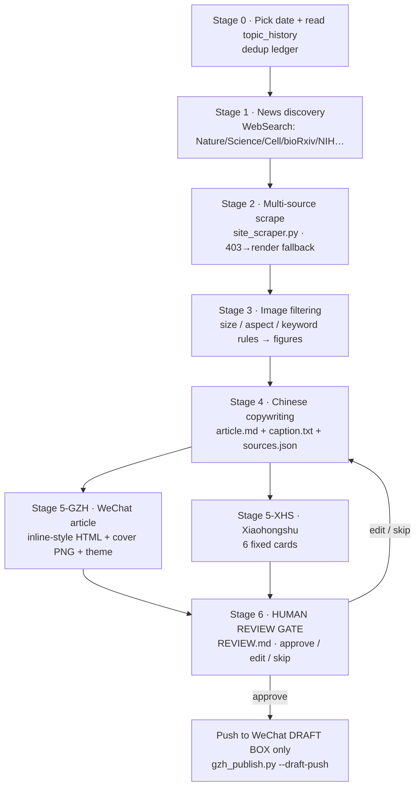

# BioSpark · AI For Bios — WeChat OA Automation Pipeline

> A [Claude Code Skill](https://code.claude.com/docs/en/skills) that turns a single life-science topic into a review-ready, dual-platform content package — a WeChat Official Account (公众号) long-form illustrated article **and** a Xiaohongshu (小红书) 6-card set — and then **stops at a human-review gate**. It never auto-publishes.

**中文文档 → [README.zh-CN.md](README.zh-CN.md)**

---

## What it is

**BioSpark** is a daily content-production line for biology / life-science news, driven by an agent reading [`SKILL.md`](SKILL.md). You give it a topic (or let it discover a fresh one), and it runs a 7-stage pipeline: topic dedup → news discovery → multi-source scraping → image filtering → Chinese copywriting → dual-platform rendering → **human review**. On approval, it pushes the article to your WeChat **draft box only** — it never mass-sends.

It is built for the Chinese-language science-communication account **"AI For Bios"** and encodes hard-won rules for producing clean, non-"AI-flavored" Chinese copy and WeChat-paste-surviving inline HTML.

## Pipeline flow



## Demo — see the output

Want to see what the pipeline actually produces? **[`demo/`](demo/)** contains one real auto-formatted WeChat article ([HTML](demo/wechat-article-demo.html) + [full-page screenshot](demo/wechat-article-demo.png)), showing the section theming, 6-part academic structure, and paste-surviving inline styles. (Third-party figures are replaced with placeholders.)


## Section themes

Each article is classified into one of four sections, which sets its accent color:

| Section | 中文 | Accent |
| --- | --- | --- |
| Frontier / breakthroughs | 前沿科创 | aqua `#4ecdc4` |
| Top-journal deep read | 顶刊精读 | orange `#ec7a26` |
| People / interviews | 人物专访 | indigo `#6366f1` |
| Tools / how-to | 工具介绍 | blue `#2563eb` |

## Install

This is a Claude Code Skill. Put it where Claude Code discovers skills:

```bash
# Option A — clone into your Claude skills directory
git clone git@github.com:yetong0516/BioSpark_AI-For-Bios_WeChat-OA-Automation-Pipeline.git \
  ~/.claude/skills/ai4s-pipeline

# Option B — copy just SKILL.md into ~/.claude/skills/ai4s-pipeline/
```

Restart Claude Code, then trigger it (see below).

## Configure

1. Copy the credential template and fill in your WeChat Official Account keys:

   ```bash
   cp secrets/weixin.example.json secrets/weixin.json
   # edit secrets/weixin.json → appId / appSecret / author
   ```

   `secrets/weixin.json` is **git-ignored** and must never be committed.

2. Add your machine's **outbound IP** to the WeChat OA IP allowlist
   (设置与开发 → 基本配置 → IP 白名单). Draft-push calls `api.weixin.qq.com` directly.

## Dependencies

- **Python 3.9+** with `requests`, `beautifulsoup4`, `lxml`, `Pillow`
- **Playwright** (Chromium) — for scraping sites behind TLS-fingerprint / 403 walls
- **Chinese fonts** — Microsoft YaHei or SimHei (for card / cover rendering)

```bash
pip install requests beautifulsoup4 lxml Pillow playwright
playwright install chromium
```

## Usage

Trigger keywords (any one activates the skill): `ai4s-xhs`, `生物产线`, `BioSpark`, `公众号`, `小红书产线`, `做一篇`, `产线跑一遍`, `今天的稿子`, `daily draft`.

```
You:  用 BioSpark 给 AlphaFold3 最新进展做今天的稿子
Claude: [activates pipeline]
        Stage 0: dedup against topic_history → drafts/2026-06-19_alphafold3-xxx/
        Stage 1: WebSearch → Nature coverage …
        Stage 2: parallel scrape Nature / Cell / Broad …
        Stage 3: pick 4 figures → images/figures/fig-1..4
        Stage 4: write article.md + caption + sources.json
        Stage 5: WeChat HTML + cover; 6 Xiaohongshu cards
        Stage 6: write REVIEW.md → STOP, await your review
You:  approve
Claude: log review + push to WeChat draft box (draft only)
```

### Daily mode

The pipeline ships no built-in scheduler. A daily 08:00 draft can be driven by Claude Code's scheduled-tasks mechanism — see [`scripts/setup_daily_task.md`](scripts/setup_daily_task.md). Scheduled runs **produce a draft and notify you only; they never publish.**

## Safety by design

- **Always stops at the human-review gate.** Publishing is only ever a manual action after you reply `approve`.
- **Draft box only, never mass-send.** Approval pushes to the WeChat draft box; broadcasting is never automated.
- **Real, sourced data only.** Every figure carries its source; no fabricated numbers or quotes.
- **Sensitive-topic caution.** For cancer / clinical / financial topics the output carries a disclaimer — it is science communication, **not medical or investment advice**.

## Repository layout

```
ai4s_pipeline/
├── SKILL.md                    Operating spec (the skill manifest)
├── scripts/
│   ├── site_scraper.py         Multi-source scraper (stage 2)
│   ├── screenshot_cards.py     HTML → PNG card / cover renderer
│   ├── gzh_publish.py          WeChat draft validate + --draft-push
│   ├── gzh_theme.py            Recolor HTML by section theme
│   ├── fetch_openfig.py        Grab bioRxiv figures past Cloudflare
│   └── setup_daily_task.md     Daily-cron config doc
├── templates/                  WeChat inline-style contract, themes, XHS card CSS
├── state/                      Runtime ledgers (dedup / review) — git-ignored
├── secrets/
│   └── weixin.example.json     Credential template (real weixin.json is git-ignored)
└── drafts/                     Runtime output packages — git-ignored
```

## License

[MIT](LICENSE) © BioSpark / AI For Bios

---

*Runtime output (`drafts/`), credentials (`secrets/weixin.json`), and internal ledgers (`state/`, `STATUS.md`) are intentionally excluded from this repository.*
