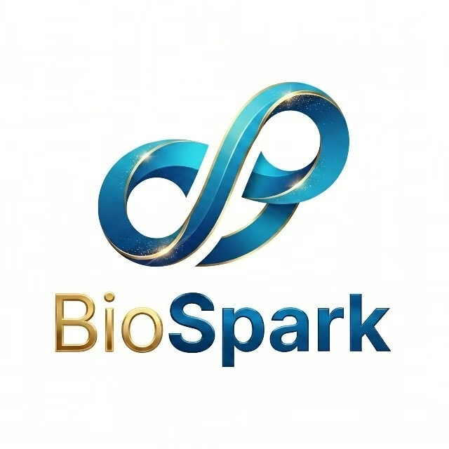
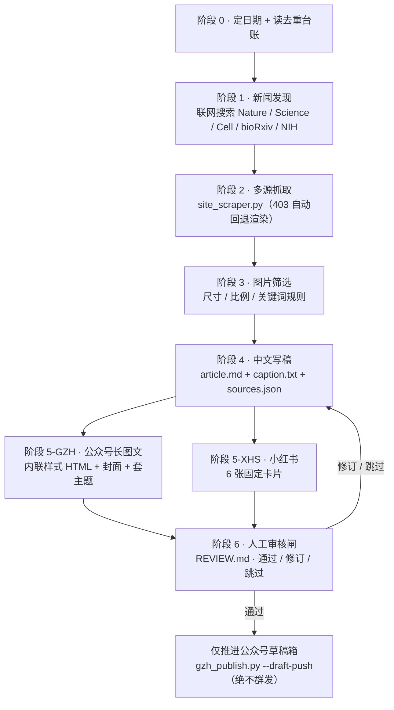
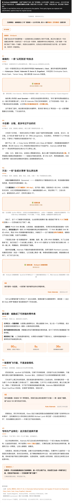

# BioSpark · AI For Bios — 公众号自动化产线

> 一个 [Claude Code Skill](https://code.claude.com/docs/en/skills):输入一个生命科学主题,产出**可审核的双平台内容包**——公众号(WeChat)长图文 **+** 小红书 6 张卡片,然后**停在人工审核闸**。永不自动发布。

**English → [README.md](README.md)**

<div align="center">



### 📣 关注公众号 **AI For Bios** · BioSpark

BioSpark ｜ AI For BioScience 专属平台 —— 全球前沿文献解读、行业动态、算法应用与效率工具，汇聚科研灵感，高效探索新知。

**边缘行者（广州）技术有限公司** 出品


<sub>微信扫码关注，或搜索 **「AI For Bios」**</sub>

<sub>本仓库这条产线产出的内容，即发布于此公众号。</sub>

</div>

---

## 这是什么

**BioSpark** 是一条生物 / 生命科学资讯的日更内容产线,由 Agent 读取 [`SKILL.md`](SKILL.md) 驱动。你给它一个主题(或让它自己找当天热点),它跑一条 7 阶段流水线:选题去重 → 新闻发现 → 多源抓取 → 图片筛选 → 中文写稿 → 双平台渲染 → **人工审核**。审核通过后,只把文章推进公众号**草稿箱**——绝不群发。

它服务于科普账号 **「AI For Bios」**,内置了一套打磨出来的规则:产出不端着、不"AI 味"的中文文案,以及能在微信粘贴后不掉格式的内联样式 HTML。

## 产线流程



## 演示 —— 看看产出长啥样

想直接看产线产出的效果?**[`demo/`](demo/)** 放了一篇真实的自动排版公众号长图文([HTML 源码](demo/wechat-article-demo.html) + [整页截图](demo/wechat-article-demo.png)),展示板块主题色、6 段学术架构、粘贴不掉格式的内联样式。(第三方配图已替换为占位框。)



## 板块与主题色

每篇文章判定为四个板块之一,对应各自的主题色:

| 板块 | 主题色 |
| --- | --- |
| 前沿科创 | aqua `#4ecdc4` |
| 顶刊精读 | orange `#ec7a26` |
| 人物专访 | indigo `#6366f1` |
| 工具介绍 | blue `#2563eb` |

## 安装

这是一个 Claude Code Skill,放到 Claude Code 能识别技能的目录即可:

```bash
# 方式 A —— clone 到你的 Claude 技能目录
git clone git@github.com:yetong0516/BioSpark_AI-For-Bios_WeChat-OA-Automation-Pipeline.git \
  ~/.claude/skills/ai4s-pipeline

# 方式 B —— 只把 SKILL.md 复制进 ~/.claude/skills/ai4s-pipeline/
```

重启 Claude Code,然后用下面的触发词唤起它。

## 配置

1. 复制凭证模板,填入你的公众号密钥:

   ```bash
   cp secrets/weixin.example.json secrets/weixin.json
   # 编辑 secrets/weixin.json → appId / appSecret / author
   ```

   `secrets/weixin.json` **已被 git 忽略**,绝不能入库。

2. 把本机的**出口 IP** 加进公众号后台的 IP 白名单
   (设置与开发 → 基本配置 → IP 白名单)。草稿直推会直连 `api.weixin.qq.com`。

## 依赖

- **Python 3.9+**,含 `requests`、`beautifulsoup4`、`lxml`、`Pillow`
- **Playwright**(Chromium)—— 用于抓取有 TLS 指纹过滤 / 403 拦截的站点
- **中文字体** —— 微软雅黑(Microsoft YaHei)或黑体(SimHei),用于卡片 / 封面渲染

```bash
pip install requests beautifulsoup4 lxml Pillow playwright
playwright install chromium
```

## 使用

触发词(命中任一即激活):`ai4s-xhs`、`生物产线`、`BioSpark`、`公众号`、`小红书产线`、`做一篇`、`产线跑一遍`、`今天的稿子`、`daily draft`。

```
你:   用 BioSpark 给 AlphaFold3 最新进展做今天的稿子
Claude:[激活产线]
       阶段0:读 topic_history 去重 → drafts/2026-06-19_alphafold3-xxx/
       阶段1:WebSearch → 找到 Nature 报道 …
       阶段2:并行抓取 Nature / Cell / Broad …
       阶段3:筛 4 张配图 → images/figures/fig-1..4
       阶段4:写 article.md + caption + sources.json
       阶段5:公众号 HTML + 封面;小红书 6 张卡片
       阶段6:生成 REVIEW.md → 停下,等你审核
你:   approve
Claude:记审核日志 + 推进公众号草稿箱(仅草稿)
```

### 日更模式

产线本身不内置定时器。每天早 8:00 出一篇草稿,可由 Claude Code 的 scheduled-tasks 机制驱动 —— 见 [`scripts/setup_daily_task.md`](scripts/setup_daily_task.md)。**定时运行只产草稿 + 通知,永不发布。**

## 安全设计

- **永远停在人工审核闸。** 发布只会是你回复 `approve` 之后的人工动作。
- **只进草稿箱,绝不群发。** approve 只把文章推进公众号草稿箱,群发永不自动化。
- **只用真实、有溯源的数据。** 每张配图都带来源;不编造数字或引语。
- **敏感话题谨慎。** 涉及肿瘤 / 临床 / 财经的内容会带免责声明 —— 这是科普,**不构成医疗或投资建议**。

## 目录结构

```
ai4s_pipeline/
├── SKILL.md                    产线操作规范(技能清单)
├── scripts/
│   ├── site_scraper.py         多源抓取(阶段 2)
│   ├── screenshot_cards.py     HTML → PNG 卡片 / 封面渲染
│   ├── gzh_publish.py          公众号草稿校验 + --draft-push
│   ├── gzh_theme.py            按板块给 HTML 套主题色
│   ├── fetch_openfig.py        绕过 Cloudflare 抓 bioRxiv 配图
│   └── setup_daily_task.md     日更定时任务配置说明
├── templates/                  公众号内联样式契约、主题、小红书卡片 CSS
├── state/                      运行台账(去重 / 审核)—— 已 git 忽略
├── secrets/
│   └── weixin.example.json     凭证模板(真实 weixin.json 已 git 忽略)
└── drafts/                     运行产物包 —— 已 git 忽略
```

## 许可

**[Business Source License 1.1 (BSL 1.1)](LICENSE)** — © BioSpark / AI For Bios

| 你想做什么 | 需要授权吗？ |
|----------|------------|
| 读源码 / 改着玩 / 个人学习 | ❌ 不需要 |
| 学术研究 / 教学 | ❌ 不需要 |
| 提 PR / Issue / 翻译 / 文档贡献 | ❌ 不需要 |
| 非商业的开源衍生项目（同 license + 注明出处）| ❌ 不需要 |
| 商业产品 / SaaS 服务 / 内容商业化运营 | ⚠️ **需要单独签商业授权** |
| 微信公众号 / 小红书 / 任何变现账号用本工具生产内容 | ⚠️ **需要单独签商业授权** |

> Change Date：**2030-08-19**（届时自动转 **Apache License 2.0**，彻底开源）。
> 商业授权联系：[open-source@biospark.example](mailto:open-source@biospark.example)
> （占位地址，发布前请替换为真实邮箱）

---

## 内容版权与原创声明

代码遵循 [LICENSE](LICENSE)；**但本产线产出的内容，版权单独受保护**。

以下作品 © BioSpark / AI For Bios，受《中华人民共和国著作权法》及国际公约保护：

- **选题与编辑框架**（哪篇论文、哪个角度、哪个板块）
- **最终成稿中文**（导语、编者按、小导语、正文、图注、来源说明、互动话题）
- **排版与版式设计**（6 段学术架构、内联样式 HTML 契约、板块主题色系统、卡片视觉系统）
- **配图筛选逻辑与图注撰写**
- **小红书 6 张卡片、公众号封面**（产线渲染的成品图）

**未经授权禁止**：任何公众号、小红书、博客、付费内容账号**转载、洗稿、爬取**本产线产出内容
（无论是否标注来源），均构成侵权。详细规则见：

- **[COPYRIGHT.md](COPYRIGHT.md)** —— 完整版权声明（归属范围、允许清单、禁止清单）
- **[NOTICE.md](NOTICE.md)** —— 侵权举报渠道、邮件模板、处理时效承诺

侵权举报邮箱：**[dmca@biospark.example](mailto:dmca@biospark.example)** *(占位地址，发布前请替换为真实邮箱)*

> ⚠️ GitHub 侧的声明**本身没有强制执行力**——它的作用是**固化作者身份 + 留证据链**。
> 真正起作用的保护是三层：
> 1. **公众号原创声明**（每篇勾选，触发微信平台级原创保护机制）—— 最重要
> 2. **git commit 时间戳证据链**（本仓库天然积累，每篇 draft 入库即有带时间戳的记录）
> 3. **硬证据：著作权登记**（中国版权保护中心，2-300 元/件，旗舰系列先登）

---

*运行产物(`drafts/`)、凭证(`secrets/weixin.json`)、内部台账(`state/`、`STATUS.md`)已刻意排除在本仓库之外。*
